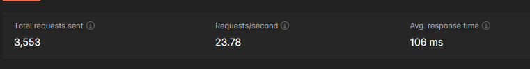

<br><br>


 <br>

- <span style="font-size:24px;">[User Stories](#user-stories)</span>
  - <span style="font-size:20px;">[User](#user)</span>
  - <span style="font-size:20px;">[Trader](#trader)</span>

- <span style="font-size:24px;">[Prototyping](#mockups)</span>
- <span style="font-size:24px;">[Demo](#user-screens)</span>
- <span style="font-size:24px;">[PlantNet + OpenAI](#plantnet)</span>
  - <span style="font-size:20px;">[PlantNet](#plantnet)</span>
  - <span style="font-size:20px;">[OpenAI](#openai)</span>
  - <span style="font-size:20px;">[Connecting the Pieces](#connecting-the-pieces)</span>
  - <span style="font-size:20px;">[The Prompt](#the-prompt)</span>
- <span style="font-size:20px;">[Tech Stack](#floravert-is-built-using-the-following-technologies)</span>
  - <span style="font-size:20px;">[Frontend](#frontend)</span>
  - <span style="font-size:20px;">[Backend](#backend)</span>
- <span style="font-size:24px;">[How to Run](#prerequisites)</span>

<br><br>

<!-- project philosophy -->


> A mobile app to help outdoor explorers, plant enthusiasts, and curious souls to identify plants, get rich descriptions, pin to map, and be able purchase plant based goods all within one place.
>
> Floravert aims at empowering nature enthusiasts with seamless plant identification, comprehensive descriptions, and a convenient marketplace, all in one app.
Enabling outdoor explorers to effortlessly connect with the plant world, fostering curiosity and appreciation for nature's wonders.
Streamlining the plant discovery journey, from identification to purchase, for a fulfilling and immersive experience in the great outdoors.

## User Stories
## User
- As a user, I want to open the camera, so I can scan any plant I want.
- As a user, I want a full and rich description of the plants I scan, so I can learn more about them.
- As a user I want to save the scan results, so I can check them later.
- As a user, I want to navigate to store, so I can order any plant based item I want.
- As a user, I want to be able to discover areas where other uses found specific plants on a map, so I can avoid wasting my time foraging in the wrong areas.
- As a user, I want to be able to message traders, so I can order the product.
## Trader
- As a trader, I want to be able to sell the plants I foraged, in both processed or raw form, so I that I could benefit from my hobby.


<br><br>

<!-- Prototyping -->


> We designed Floravert using wireframes and mockups, iterating on the design until we reached the ideal layout for easy navigation and a seamless user experience.


### Mockups
| Landing screen  | Login screen  | Home Screen |
| ---| ---| ---|
|  |  |  |
| Product screen  | Map screen  | Home Screen |
|  |  |  |
| Chat Screen |
|  |

<br><br>

<!-- Implementation -->


> Using the wireframes and mockups as a guide, we implemented the Floravert app with the following features:

### User Screens
| Login screen  | Scan screen | Map screen | Chat screen |
| ---| ---| ---| ---|
|  |  |  |  |
| Register screen  | Setup Screen | Market Screen | Profile Screen |
|  |  |  |  |


<br><br>


> Floravert makes use of open access to 3rd party apis to fulfill its mission: "Be there to help users identify any plant they want, from a single image". To acheive this mission, we had to use two separate and indeed powerful apis: Plant Net's API for plant identification, and OpenAI's API for text generation. Before we go into details on how it's done, let's first introduce PlantNet and OpenAI.

### PlantNet
- PlantNet is a renowned organization committed to plant identification and conservation. Their mission is to create a global network of individuals and experts who collaborate to identify and document plant species through a mobile application. By harnessing the power of crowdsourcing and artificial intelligence, PlantNet aims to increase botanical knowledge, promote biodiversity conservation, and facilitate ecological research for the benefit of both scientific communities and the general public.
### OpenAI:
- OpenAI is a leading artificial intelligence research organization focused on developing advanced AI technologies. They are known for creating powerful language models like GPT-3, which can understand and generate human-like text. OpenAI aims to promote the responsible and ethical use of AI while advancing the boundaries of what AI systems can accomplish.

### Connecting the Pieces:
> PlantNet's Model is able to identify plants with amazing accuracy, and it returns a rich collection of data to work with. The returned response looks something like this:

```JSON
{
  "query": {
    "project": "best",
    "images": [
      "buffer_code_image_1",
      "buffer_code_image_2"
    ],
    "organs": [
      "flower",
      "leaf"
    ]
  },
  "language": "en",
  "preferedReferential": "useful",
  "results": [
    {
      "score": 0.9952006530761719,
      "species": {
        "scientificNameWithoutAuthor": "Hibiscus rosa-sinensis",
        "scientificNameAuthorship": "L.",
        "genus": {
          "scientificNameWithoutAuthor": "Hibiscus",
          "scientificNameAuthorship": "L."
        },
        "family": {
          "scientificNameWithoutAuthor": "Malvaceae",
          "scientificNameAuthorship": "Juss."
        },
        "commonNames": [
          "Chinese hibiscus",
          "Hawaiian hibiscus",
          "Hibiscus"
        ]
      }
    }
  ],
  "remainingIdentificationRequests": 1228
}
```
> We can see that we have plenty of details already, and most importantly we notice that the result of our scan is a results array, each having a score. We'll discuss the score later on, but for now, let's discuss which pieces of the results are required for our use case.

```JSON

"species": {
	"scientificNameWithoutAuthor": "Hibiscus rosa-sinensis", //here
	"scientificNameAuthorship": "L.",
	"genus": {
		"scientificNameWithoutAuthor": "Hibiscus",
		"scientificNameAuthorship": "L."
	},
	"family": {
		"scientificNameWithoutAuthor": "Malvaceae",
		"scientificNameAuthorship": "Juss."
	},
	"commonNames": [
		"Chinese hibiscus", //here
		"Hawaiian hibiscus",
		"Hibiscus"
	]
}


```
> We are only interested in the common name of the plant as well as its scientific name, which are going to be sent in a prompt to one of OpenAI's Models in order to generate the required description. But before we skip to the next step, let's discuss the score. The score here represents the confidence level assigned to a given prediction, think of it as the degree to which the model is confident that its response is correct, and from that we deduce that a score closer to 1 implies a more reliable result (but take that with a grain of salt). It is also worthy to note that PlantNet's API returns the results in decreasing order and thus the best match is always the first element in the array and based on that Floravert takes only the first element in the array to feed to OpenAI's Model.

### The Prompt
> Plenty of consideration was taken into designing the prompt which was to be fed to OpenAI's model, it had to be accurate and retieve only the required data. It also had to be brief and straight to the point to optimize the costs of calling the api. After extensive testing, we found that this prompt fit our needs the best:

```js
`generate only a JSON Parsable Object for a plant called "${commonName}", with scientific name "${botanicalName}
    " and fill, with real accurate data, the following:
    Follow this structure:
    {
        "commonName": ${commonName},
        "botanicalName": ${botanicalName},
        "description": insert generated description here
        "keyFacts": {
            "seasonality": one word only
            "edibility": one word only
            "habitat": one word only
            "toxicity": one word only
            "use": one word only
            "status": one word only 
        },
        "recipes": [
            {
                "name": insert name here,
                "ingredients": insert ingredients here
            }
        ],
        "benefits": [
            "insert only 3 benefits here"
        ],
        "commonUses": [
            "insert only 3 common uses here"
        ],
        "regions": [
            "insert regions here -- by one word name"
        ]
    }
    
    `
```
> So far this prompt hasn't failed even once to get the data correctly and accurately as expected. Now let's see an example of the response before we conclude this section.

```JSON
{
    "data": {
        "image": "", //link to image storage location
        "result": {
            "commonName": "Rosemary",
            "botanicalName": "Rosmarinus officinalis",
            "description": "Rosemary is an evergreen shrub with fragrant, needle-like leaves and small, pale blue flowers. It is native to the Mediterranean region and is a popular culinary herb.",
            "keyFacts": {
                "seasonality": "Perennial",
                "edibility": "Edible",
                "habitat": "Mediterranean",
                "toxicity": "Non-toxic",
                "use": "Herbal",
                "status": "Cultivated"
            },
            "recipes": [
                {
                    "name": "Rosemary Roasted Potatoes",
                    "ingredients": "Potatoes, olive oil, rosemary, garlic, salt, pepper"
                }
            ],
            "benefits": [
                "Improves digestion",
                "Boosts immune system",
                "Reduces inflammation"
            ],
            "commonUses": [
                "Cooking",
                "Aromatherapy",
                "Medicinal"
            ],
            "regions": [
                "Europe",
                "Asia",
                "Africa"
            ]
        }
    }
}
```

<br><br>

<!-- Tech stack -->


##  Floravert is built using the following technologies:

### Frontend
> Floravert is built with Flutter, which gives it amazing performance compared to other non-native mobile development framework, while maintaining its cross-platform prowess.

#### Floravert App uses:
- Provider package for state management (https://pub.dev/packages/provider)
- Dio for fetching data from API endpoints (https://pub.dev/packages/dio)
- Intl & Intl_phone_number_input to retrieve and validate phone number input (https://pub.dev/packages/intl_phone_number_input)
- Shimmer Package to create attractive skeleton loading effects (https://pub.dev/packages/shimmer)
- Image-Picker package to help users select one or multiple images / take pictures (https://pub.dev/packages/image_picker)
- flutter_chat_ui for attractive messaging UI/UX (https://pub.dev/packages/flutter_chat_ui)
- Flutter_Map to build maps with custom widgets as markers (https://pub.dev/packages/flutter_map)
### Backend
> Floravert's Backend is built on top of Node.js, with the use of Express framework and Typescript. As for persistent storage, Floravert uses MongoDB. For media storage, Floravert has its own AWS S3 Bucket.

#### Floravert Backend uses:
- Socket.IO to handle messaging (https://socket.io/)
- Mongoose ODM to interact with MongoDB (https://mongoosejs.com/)
- Axios library for fetching data from apis (https://www.npmjs.com/package/axios)
- AWS-SDK Module for interacting with S3 Bucket Programmatically (https://www.npmjs.com/package/aws-sdk)
- JWT for user authentication and Authorization (https://jwt.io/)
- OpenAI module for interacting with OpenAI's API (https://www.npmjs.com/package/openai)
- Express_Validator Module for validating api request data (https://www.npmjs.com/package/express-validator)

<br><br>


## Postman Performance Tests
> Floravert was tested for performance on the remote server (AWS EC2) and here is a sample of the results
 - Login Route [http://54.195.140.2:80/user/login]
 <br>
 
 - Add Scanned Result Route [http://54.195.140.2:80/user/scanned/add]
 <br>
 
 - Generate Scan Results [http://54.195.140.2:80/user/scanned/apis/3rd_party/openai/generate]
 <br>
 

<br><br>

<!-- How to run -->


> To set up Floravert locally, follow these steps:

## Prerequisites
- Node.js
- Flutter

## Project Installation
### Flutter

1 - Running flutter after cloning it is very straight-forward. All that is required is that after cloning the repo, run the following command:

```sh
flutter run
```

don't create a .env file the root of the flutter folder

```sh
cd frontend/mobile
nano .env
```
or create the file using GUI

In the .env file fill only the following field

```sh
BASE_URL=your-base-url:port
```


### Backend
> To run the server do the following:

- Navigate to backend directory
```sh
cd backend
```
- Install the required node modules
```sh
npm install
```
- create a .env file and paste the following:
```t
#host
PORT= #your port goes here
HOST_ADDRESS= #insert your host address

#database
DB_NAME= #insert database name
DB_PORT= #insert database port

#JWT SECRET
JWT_SECRET_KEY= #insert your JWT secret here

#S3 Bucket
S3_BUCKET_NAME= #insert your s3 bucket name
S3_BUCKET_REGION= #insert your s3 bucket region
AWS_SECRET_KEY= #insert your aws secret key
AWS_ACCESS_KEY= #insert your aws access key


#OPENAI
OPENAI_API_KEY= #insert your OpenAI API Key

#PLANTNET
PLANTNET_API_KEY= #insert your planetnet API key
```

Now, you should be able to run Floravert locally and explore its features.