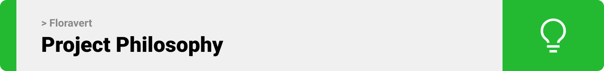
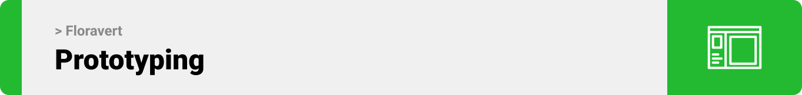

<br><br>


<br><br>

<!-- project philosophy -->


> A mobile app to help outdoor explorers, plant enthusiasts, and curious souls to identify plants, get rich descriptions, pin to map, and be able purchase plant based goods all within one place.
>
> Floravert aims at empowering nature enthusiasts with seamless plant identification, comprehensive descriptions, and a convenient marketplace, all in one app.
Enabling outdoor explorers to effortlessly connect with the plant world, fostering curiosity and appreciation for nature's wonders.
Streamlining the plant discovery journey, from identification to purchase, for a fulfilling and immersive experience in the great outdoors.

### User Stories
- As a user, I want to open the camera, so I can scan any plant I want.
- As a user, I want to navigate to store, so I can order any plant based item I want.
- As a user, I want to navigate to have an option choosing between processed and raw products, so I can order based on my preferences.
- As a user, I want to be able to discover areas where other uses found specific plants on a map, so I can avoid wasting my time foraging in the wrong areas.
- As a user, I want to be able to sell the plants I foraged, in both processed or raw form, so I that I could benefit from my hobby.
-As a user, I want to be able to message traders, so I can order the product.

<br><br>

<!-- Prototyping -->


> We designed Floravert using wireframes and mockups, iterating on the design until we reached the ideal layout for easy navigation and a seamless user experience.


### Mockups
| Landing screen  | Login screen  | Home Screen |
| ---| ---| ---|
|  |  |  |
| Product screen  | Map screen  | Home Screen |
|  |  |  |
| Chat Screen |
|  |

<br><br>

<!-- Implementation -->


> Using the wireframes and mockups as a guide, we implemented the Floravert app with the following features:

### User Screens (Mobile)
| Login screen  | Scan screen | Map screen | Chat screen |
| ---| ---| ---| ---|
|  |  |  |  |
<!-- | Home screen  | Menu Screen | Order Screen | Checkout Screen |
|  |  |  |  | -->


<br><br>


<br><br>

<!-- Tech stack -->


###  Floravert is built using the following technologies:

- This project uses the [Flutter app development framework](https://flutter.dev/). Flutter is a cross-platform hybrid app development platform which allows us to use a single codebase for apps on mobile, desktop, and the web.
- For persistent storage (database), the app uses the [Mongoose](https://mongoosejs.com/) package which allows the app to create a custom storage schema and save it to a MongoDB database.
- To send local push notifications, the app uses the [flutter_local_notifications](https://pub.dev/packages/flutter_local_notifications) package which supports Android, iOS, and macOS.

<br><br>

<!-- How to run -->


> To set up Floravert locally, follow these steps:

### Prerequisites

This is an example of how to list things you need to use the software and how to install them.
* npm
  ```sh
  npm install npm@latest -g
  ```

### Installation

_Below is an example of how you can instruct your audience on installing and setting up your app. This template doesn't rely on any external dependencies or services._

1. Get a free API Key at [https://example.com](https://example.com)
2. Clone the repo
   ```sh
   git clone https://github.com/your_username_/Project-Name.git
   ```
3. Install NPM packages
   ```sh
   npm install
   ```
4. Enter your API in `config.js`
   ```js
   const API_KEY = 'ENTER YOUR API';
   ```

Now, you should be able to run Coffee Express locally and explore its features.